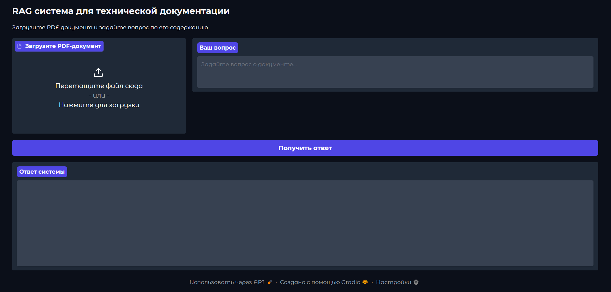

# RAG-system

RAG (Retrieval-Augmented Generation) система для работы с технической документацией на русском и английском языках. Система использует современные языковые модели и поддерживает OCR для обработки сканированных документов.

## Возможности

- **Мультиязычность**: Поддержка русского и английского языков
- **OCR**: Обработка сканированных PDF документов с помощью Docling VLM
- **Современные модели**: Использование Llama 3.2 и многоязычных эмбеддингов
- **Векторный поиск**: ChromaDB для эффективного поиска по документам
- **Web интерфейс**: Удобный UI на базе Gradio
- **Docker**: Готовое решение для контейнеризации
- **Источники**: Указание источников информации с номерами страниц

### Основные компоненты:

- **Docling**: Продвинутая обработка PDF с OCR
- **LangChain**: Оркестрация RAG pipeline
- **Llama 3.2 1B**: Генерация ответов
- **Sentence Transformers**: Многоязычные эмбеддинги
- **ChromaDB**: Векторная база данных
- **Gradio**: Web интерфейс

## Getting started

```bash
git clone https://github.com/codemurt/rag-system.git
cd rag-system

docker-compose up -d

open http://localhost:7860
```

## Установка

### Вариант 1: Docker (рекомендуется)

1. **Клонируйте репозиторий:**
```bash
git clone https://github.com/codemurt/rag-system.git
cd rag-system
```

2. **Соберите и запустите контейнеры:**
```bash
docker-compose build
docker-compose up -d
```

3. **Проверьте статус:**
```bash
docker-compose ps
docker-compose logs -f
```

### Вариант 2: Локальная установка

1. **Создайте виртуальное окружение:**
```bash
python -m venv venv
source venv/bin/activate  # Linux/macOS
# или
venv\Scripts\activate  # Windows
```

2. **Установите зависимости:**
```bash
pip install -r requirements.txt
```

3. **Запустите приложение:**
```bash
python app.py
```

## Использование

### Web интерфейс

1. Откройте браузер и перейдите на http://localhost:7860
2. Загрузите PDF документ через интерфейс
3. Введите вопрос о содержании документа
4. Получите ответ с указанием источников





### Структура проекта

```
rag-system/
├── app.py                 # Основное приложение
├── requirements.txt       # Python зависимости
├── Dockerfile            # Docker образ
├── notebook.ipynb        # Пример запуска без GUI
├── notebook_gradio.ipynb        # Пример запуска с Gradio
├── docker-compose.yml    # Docker-compose конфигурация
├── .env                  # Переменные окружения
├── README.md            # Документация
├── chroma_db/           # Векторная БД (создается автоматически)
├── logs/                # Логи (создается автоматически)
└── uploads/             # Загруженные файлы
```